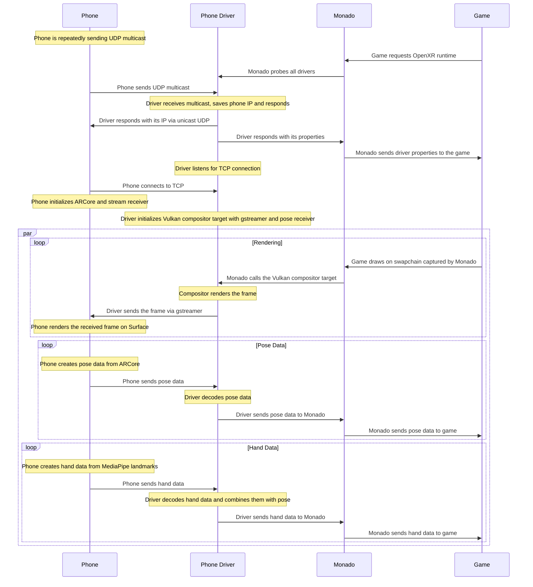

# Monado Phone Driver

This is a Monado driver and Android app that allows you to play advanced VR games just with your phone.
Currently, it implements **UDP HEVC streaming** to phone, **6DOF tracking** with ARCore and **hand tracking** with MediaPipe.

> [!NOTE]
> This repo is a fork of the original Monado.
> The original Monado is available at https://gitlab.freedesktop.org/monado/monado/

> [!WARNING]  
> Like other VR applications, this software may cause motion sickness, dizziness, nausea, or discomfort. Stop using it immediately if you experience any of these symptoms.

> [!WARNING]
> This driver is still in development and may not work as expected.
> Tested only on Moto G85 with Android 16 and Arch Linux with RTX 5060.

## Table of Contents

- [Requirements](#requirements)
- [Getting Started](#getting-started)
  - [Dependencies](#dependencies)
  - [Automatic installation](#automatic-installation)
  - [Manual installation](#manual-installation)
- [Building from source](#building-from-source)
  - [Prerequisites](#prerequisites)
  - [Driver](#driver)
  - [App](#app)
- [Usage](#usage)
  - [Steam](#steam)
  - [Configuration file](#configuration-file)
  - [PC camera hand tracking](#pc-camera-hand-tracking)
- [Architecture](#architecture)
  - [Phone](#phone)
  - [Driver](#driver-1)
  - [Diagram](#diagram)
- [Generative AI Disclosure](#generative-ai-disclosure)

## Requirements

- Android phone with minimal API level 29 (Android 10)
- Linux PC
- HMD to put your phone in, something like [Google Cardboard](https://arvr.google.com/cardboard/). It needs to have hole for back camera.

## Getting Started

> [!NOTE]
> This is full replacement of Monado, so you don't need to have installed anything except dependencies listed below.

### Dependencies

Install these packages on your Linux PC (or equivalent for your distro, with package manager of your choice):

```sh
sudo pacman -Sy --needed \
python3 \
dbus \
glibc \
glib2 \
gst-plugins-base-libs \
gstreamer \
libbsd \
libgcc \
libjpeg-turbo \
libstdc++ \
libusb \
libxcb \
libx11 \
sdl2-compat \
systemd-libs \
vulkan-icd-loader \
zlib
```

### Automatic installation

1. Download `installer.py` from [Releases](https://github.com/ttomf/monado-phone/releases)
2. Run `python installer.py` on your Linux PC in directory where you want to install Monado Phone Driver
3. Follow the instructions

### Manual installation

1. Download `MonadoPhone.apk`, `libopenxr_monado.so`, `monado-service` and `openxr_monado-dev.json` from [Releases](https://github.com/ttomf/monado-phone/releases)
2. Install `MonadoPhone.apk` on your phone (via `adb` or your preferred method) and run it (Monado driver on PC has 5s timeout, so it's better to start the app first)
3. Run `monado-service` on your Linux PC and wait for the phone to connect (phone app will tell you it's connected)
4. Open another terminal and run your OpenXR application with **environment variable** set (make sure `libopenxr_monado.so` is in same directory as `openxr_monado-dev.json`, or path in `openxr_monado-dev.json` is correct):

```sh
export XR_RUNTIME_JSON=openxr_monado-dev.json
xrgears # demo, you can run any other OpenXR application
```

Or you can create symlink to `openxr_monado-dev.json` in `~/.config/openxr/1/active_runtime.json` and run VR app without `XR_RUNTIME_JSON` environment variable.

## Building from source

### Prerequisites

You will need **CMake 3.13 or newer** to generate build files, **make/ninja** to build Monado and **Android Studio** to build the app.
You will also need these dependencies (from [original Monado README](https://gitlab.freedesktop.org/monado/monado/-/blob/main/README.md)):

- Python 3.6 or newer
- Vulkan headers and loader
- OpenGL headers
- Eigen3
- glslangValidator
- libusb
- libudev
- Video 4 Linux

Clone the repository and navigate to it:

```sh
git clone https://github.com/ttomf/monado-phone.git
cd monado-phone
```

### Driver

1. Create a build directory and navigate to it:
   ```sh
   mkdir build
   cd build
   ```
2. Run `cmake` to configure the build:
   ```sh
   cmake ..
   ```
3. Build the driver:
   ```sh
   make
   ```

This will create these important files:

- **OpenXR library** in `build/src/xrt/targets/openxr/libopenxr_monado.so`
- **OpenXR runtime configuration** in `build/openxr_monado-dev.json`
- **Monado service** in `build/src/xrt/targets/service/monado-service`

### App

1. Open Android Studio and select **Open an existing project**.
2. Navigate to the `app` directory and select it.
3. Build the app as you would with any other Android project.

## Usage

### Steam

If you want to use it with Steam game, add the following environment variables to your Steam game **launch options** (you will need to provide full path to the OpenXR runtime configuration and replace `$UID` with your actual user ID):

```
XR_RUNTIME_JSON=openxr_monado-dev.json PRESSURE_VESSEL_FILESYSTEMS_RW=/run/user/$UID/monado_comp_ipc %command%
```

If the game doesn't support OpenXR, I sugest using `opencomposite` with same environment variables as above.

### Configuration file

Monado Phone Driver uses `~/.config/monado-phone/config.cfg` file to load configuration. After every change, you need to restart monado-service to apply changes. The file is in `key=value` format, must end with newline and cannot have comments.

| key | initial value | description |
| --- | --- | --- |
| port | 5500 | UDP port for discovery |
| multicast_addr | 239.1.1.1 | address of multicast group for discovery |
| config_port | 5501 | UDP port for configuration socket |
| stream_port | 5502 | UDP port for streaming |
| pose_port | 5503 | UDP port for pose receiving |
| hand_port | 5504 | UDP port for hand landmarks receiving |
| stream_w | 1280 | width of the stream |
| stream_h | 720 | height of the stream |
| screen_w | 2400 | phone screen width in pixels |
| screen_h | 1080 | phone screen height in pixels |
| screen_w_m | 0.16 | phone screen width in meters |
| screen_h_m | 0.07 | phone screen height in meters |
| k1 | 0.12 | distortion factor k1 |
| k2 | 0.12 | distortion factor k2 |
| inter_lens | 0.060 | inter-lens distance in meters |
| screen_to_lens | 0.050 | distance between phone screen and lens in meters |
| tray_to_lens | 0.035 | vertical distance from bottom of the phone tray to lens in meters |

### PC camera hand tracking

To run hand tracking on PC, you need to install Python [MediaPipe](https://developers.google.com/edge/mediapipe/solutions/guide) and [cv2](https://opencv.org/) package:

```sh
pip install mediapipe cv2
```

Then, run `python hand_tracking.py` in the `utils` directory.

> [!IMPORTANT]
> You will first need to disable the phone's hand tracking in Android app settings.

## Architecture

### Phone

On startup, the phone requests camera permission, creates two **AndroidViews** (one for camera preview for ARCore and second for stream rendering) and starts to send **UDP multicast** on `239.1.1.1:5500`. When PC responds, the phone saves the PC's IP, connects to PC via TCP as config stream and starts to send pose and receive H.265 (HEVC) stream.

The pose is taken from the ARCore session when frame is drawn. It is encoded as 40-byte buffer with **timestamp** (int64), **tracking state** (int32), **quaternion** (4x float) and **pose** (3x float), then sent over UDP.

The stream is received, RTP depacketized and decoded by **MediaCodec (video/hevc)**, which renders video directly on the AndroidView.

Hand tracking is done by MediaPipe Hand Landmarker. It shares the same camera as ARCore. MediaPipe provides hand landmarks in 2D relative to the camera. The landmarks are converted to 3D using distance between wrist and fingers. Hand landmarks are encoded as **9, 261 or 513-byte buffer** (depends on how many hands are visible) and sent over UDP, in space **relative to camera**.

### Driver

When the driver gets probed, it waits **5s** to receive a multicast response from the phone. If no response is received, it times out and lets Monado continue with software fallback. When the driver receives a response, it saves the phone's IP, listens for TCP connection (config stream) and starts to send H.265 (HEVC) stream and receive pose over UDP. It loads configuration file from `~/.config/monado-phone/config.cfg`.

The stream is taken when Monado draws on Vulkan image owned by the driver. Then the image is encoded and send in one gstreamer pipeline.

Pose receiving thread listens on UDP port, decodes the pose and pushes it to the relation history.

Hand tracking thread listens on UDP port and decodes the hand landmarks. When Monado wants hand poses, it takes the landmarks and combines them with the pose to get world space hand poses, and pushes them into Monado.

### Diagram



## Generative AI Disclosure

**Tool used:** DeepSeek V4 Flash via opencode

**Used for:** Generative AI was used to create low-level boilerplate code for Vulkan management and rendering setup in the Android application, as well as primarily for debugging.

**Human ownership:** All architecture, project structure, and application logic were designed and directed by me. I rewrote most of the AI-generated code line by line, reviewed it, tested it, and optimized it. This README was not written by generative AI.

