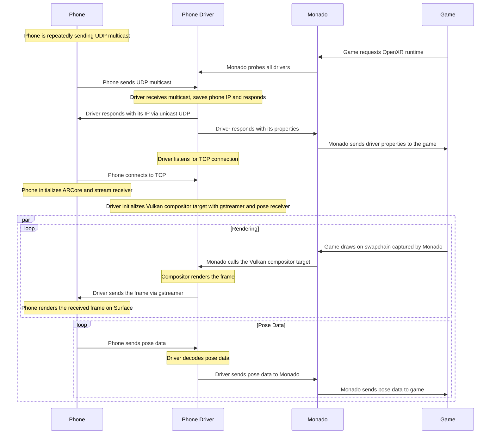

# Monado Phone Driver

This is a Monado driver and Android app that allows you to play advanced VR games just with your phone.
Currently, it implements **UDP HEVC streaming** to phone and **6DOF tracking** with ARCore.

> [!WARNING]
> This driver is still in development and may not work as expected.
> Tested only on Moto G85 with Android 16 and Arch Linux with RTX 5060.

## Requirements

- Android phone with minimal API level 29 (Android 10)
- Linux PC
- HMD to put your phone in, something like [Google Cardboard](https://arvr.google.com/cardboard/)

## Getting Started

> [!NOTE]
> This is full replacement of Monado, so you don't need to have installed anyting except depencies listed below.

1. Download `MonadoPhone.apk`, `libopenxr_monado.so`, `monado-service` and `openxr_monado-dev.json` from [Releases](https://github.com/ttomf/monado-phone/releases)
2. Install `MonadoPhone.apk` on your phone (via `adb` or your preferred method) and run it (Monado driver on PC has 5s timeout, so it's better to start the app first)
3. Install these packages on your Linux PC:
  ```sh
  sudo pacman -Sy --needed \
  dbus \
  glibc \
  glib2 \
  gst-plugins-base-libs \
  gstreamer \
  libbsd \
  libgcc \
  libjpeg-turbo \
  libstdc++ \
  libusb \
  libxcb \
  libx11 \
  sdl2-compat \
  systemd-libs \
  vulkan-icd-loader \
  zlib
  ```
4. Run `monado-service` on your Linux PC and wait for the phone to connect (phone app will tell you)
5. Open another terminal and run your OpenXR application with **environment variable** set (make sure `libopenxr_monado.so` is in same directory as `openxr_monado-dev.json`, or path in `openxr_monado-dev.json` is correct):
  ```sh
  export XR_RUNTIME_JSON=openxr_monado-dev.json
  xrgears # demo, you can run any other OpenXR application
  ```

### Steam

If you want to use it with Steam game, add the following environment variables to your Steam game **launch options** (you will need to provide full path to the OpenXR runtime configuration and replace `$UID` with your actual user ID):

```
XR_RUNTIME_JSON=openxr_monado-dev.json PRESSURE_VESSEL_FILESYSTEMS_RW=/run/user/$UID/monado_comp_ipc %command%
```

If the game doesn't support OpenXR, I sugest using `opencomposite` with same environment variables as above.


## Building from source

### Prerequisites

You will need **CMake 3.13 or newer** to generate build files, **make/ninja** to build Monado and **Android Studio** to build the app.
You will also need these dependencies (from [original Monado README](https://gitlab.freedesktop.org/monado/monado/-/blob/main/README.md)):
- Python 3.6 or newer
- Vulkan headers and loader
- OpenGL headers
- Eigen3
- glslangValidator
- libusb
- libudev
- Video 4 Linux

Clone the repository and navigate to it:

```sh
git clone https://github.com/ttomf/monado-phone.git
cd monado-phone
```

### Driver

1. Create a build directory and navigate to it:
   ```sh
   mkdir build
   cd build
   ```
2. Run `cmake` to configure the build:
   ```sh
   cmake ..
   ```
3. Build the driver:
   ```sh
   make
   ```

This will create these important files:

- **OpenXR library** in `build/src/xrt/targets/openxr/libopenxr_monado.so`
- **OpenXR runtime configuration** in `build/openxr_monado-dev.json`
- **Monado service** in `build/src/xrt/targets/service/monado-service`

### App

1. Open Android Studio and select **Open an existing project**.
2. Navigate to the `app` directory and select it.
3. Build the app as you would with any other Android project.

## Architecture

### Phone

On startup, the phone requests camera permission, creates two **AndroidViews** (one for camera preview for ARCore and second for stream rendering) and starts to send **UDP multicast** on `239.1.1.1:5500`. When PC responds, the phone saves the PC's IP, connects to PC via TCP as config stream and starts to send pose and receive H.265 (HEVC) stream.

The pose is taken from the ARCore session when frame is drawn. It is encoded as 40-byte buffer with **timestamp** (int64), **tracking state** (int32), **quaternion** (4x float) and **pose** (3x float), then sent over UDP.

The stream is received, RTP depacketized and decoded by **MediaCodec (video/hevc)**, which renders video directly on the AndroidView.

### Driver

When the driver gets probed, it waits **5s** to receive a multicast response from the phone. If no response is received, it times out and lets Monado continue with software fallback. When the driver receives a response, it saves the phone's IP, listens for TCP connection (config stream) and starts to send H.265 (HEVC) stream and receive pose over UDP.

The stream is taken when Monado draws on Vulkan image owned by the driver. Then the image is encoded and send in one gstreamer pipeline.

Pose receiving thread listens on UDP port, decodes the pose and pushes it to the relation history.

### Diagram



## Generative AI Disclosure

**Tool used:** DeepSeek V4 Flash via opencode

**Used for:** Generative AI was used to create low-level boilerplate code for Vulkan management and rendering setup in the Android application, as well as primarily for debugging.

**Human ownership:** All architecture, project structure, and application logic were designed and directed by me. I rewrote most of the AI-generated code line by line, reviewed it, tested it, and optimized it. This README was not written by generative AI.

---

<details>
<summary>Original Monado README</summary>

# Monado - XR Runtime (XRT)

<!--
Copyright 2018-2021, Collabora, Ltd.

SPDX-License-Identifier: CC-BY-4.0

This must stay in sync with the last section!
-->

> - Main homepage and documentation: <https://monado.freedesktop.org/>
> - Promotional homepage: <https://monado.dev>
> - Maintained at <https://gitlab.freedesktop.org/monado/monado>
> - Latest API documentation: <https://monado.pages.freedesktop.org/monado>
> - Continuously-updated changelog of the default branch:
>   <https://monado.pages.freedesktop.org/monado/_c_h_a_n_g_e_l_o_g.html>

Monado is an open source XR runtime delivering immersive experiences such as VR
and AR on mobile, PC/desktop, and any other device
(because gosh darn people
come up with a lot of weird hardware).
Monado aims to be a complete and conforming implementation
of the OpenXR API made by Khronos.
The project is primarily developed on GNU/Linux, but also runs on Android and Windows.
"Monado" has no specific meaning and is just a name.

## Monado source tree

- `src/xrt/include` - headers that define the internal interfaces of Monado.
- `src/xrt/compositor` - code for doing distortion and driving the display hardware of a device.
- `src/xrt/auxiliary` - utilities and other larger components.
- `src/xrt/drivers` - hardware drivers.
- `src/xrt/state_trackers/oxr` - OpenXR API implementation.
- `src/xrt/targets` - glue code and build logic to produce final binaries.
- `src/external` - a small collection of external code and headers.

## Getting Started

Dependencies include:

- [CMake][] 3.13 or newer (Note Ubuntu 18.04 only has 3.10)
- Python 3.6 or newer
- Vulkan headers and loader - Fedora package `vulkan-loader-devel`
- OpenGL headers
- Eigen3 - Debian/Ubuntu package `libeigen3-dev`
- glslangValidator - Debian/Ubuntu package `glslang-tools`, Fedora package `glslang`.
- libusb
- libudev - Debian/Ubuntu package `libudev-dev`, Fedora package `systemd-devel`
- Video 4 Linux - Debian/Ubuntu package `libv4l-dev`.

Optional (but recommended) dependencies:

- libxcb and xcb-xrandr development packages
- [OpenHMD][] 0.3.0 or newer (found using pkg-config)

Truly optional dependencies, useful for some drivers, app support, etc.:

- Doxygen - Debian/Ubuntu package `doxygen` and `graphviz`
- Wayland development packages
- Xlib development packages
- libhidapi - Debian/Ubuntu package `libhidapi-dev`
- OpenCV
- libuvc - Debian/Ubuntu package `libuvc-dev`
- libjpeg
- libbluetooth - Debian/Ubuntu package `libbluetooth-dev`
- libsdl - Debian/Ubuntu package `libsdl2-dev`

Experimental Windows support requires the Vulkan SDK and also needs or works
best with the following vcpkg packages installed:

- pthreads eigen3 libusb hidapi zlib doxygen

If you have a recent [vcpkg](https://vcpkg.io) installed and use the appropriate
CMake toolchain file, the vcpkg manifest in the Monado repository will instruct
vcpkg to locally install the dependencies automatically. The Vulkan SDK
installer should set the `VULKAN_SDK` Windows environment variable to point
at the installation location (for example, `C:/VulkanSDK/1.3.250.1`), though
make sure you open a new terminal (or open the CMake GUI) _after_ doing that
install to make sure it is available.

Monado has been tested on these distributions, but is expected to work on almost
any modern distribution.

- Ubuntu 24.04, 22.04, 20.04, (18.04 may not be fully supported)
- Debian 11 `bookworm`, 10 `buster`
  - Up-to-date package lists can be found in our CI config file,
    `.gitlab-ci.yml`
- Archlinux

These distributions include recent-enough versions of all the
software to use direct mode,
without using any external, third-party, or backported
package sources.

See also [Status of DRM Leases][drm-lease]
for more details on specific packages, versions, and commits.

Due to the lack of a OpenGL extension: GL_EXT_memory_object_fd on Intel's
OpenGL driver, only the AMD
radeonsi driver and the proprietary NVIDIA driver will work for OpenGL OpenXR
clients. This is due to a requirement of the Compositor. Support status of the
extension can be found on the [mesamatrix website][mesamatrix-ext].

### CMake

Build process is similar to other CMake builds,
so something like the following will build it.

Go into the source directory, create a build directory,
and change into it.

```bash
mkdir build
cd build
```

Then, invoke [CMake to generate a project][cmake-generate].
Feel free to change the build type or generator ("Ninja" is fast and parallel) as you see fit.

```bash
cmake .. -DCMAKE_BUILD_TYPE=Debug -G "Unix Makefiles"
```

If you plan to install the runtime,
append something like `-DCMAKE_INSTALL_PREFIX=~/.local`
to specify the root of the install directory.
(The default install prefix is `/usr/local`.)

To build, [the generic CMake build commands][cmake-build] below will work on all systems,
though you can manually invoke your build tool (`make`, `ninja`, etc.) if you prefer.
The first command builds the runtime and docs,
and the second, which is optional, installs the runtime under `${CMAKE_INSTALL_PREFIX}`.

```bash
cmake --build .
cmake --build . --target install
```

Alternately, if using Make, the following will build the runtime and docs, then install.
Replace `make` with `ninja` if you used the Ninja generator.

```bash
make
make install
```

Documentation can be browsed by opening `doc/html/index.html` in the build directory in a web browser.

## Getting started using OpenXR with Monado

This implements the [OpenXR][] API,
so to do anything with it, you'll need an application
that uses OpenXR, along with the OpenXR loader.
The OpenXR loader is a glue library that connects OpenXR applications to OpenXR runtimes such as Monado
It determines which runtime to use by looking for the config file `active_runtime.json` (either a symlink to
or a copy of a runtime manifest) in the usual XDG config paths
and processes environment variables such as `XR_RUNTIME_JSON=/usr/share/openxr/0/openxr_monado.json`.
It can also insert OpenXR API Layers without the application or the runtime having to do it.

You can use the `hello_xr` sample provided with the OpenXR SDK.

The OpenXR loader can be pointed to a runtime json file in a nonstandard location with the environment variable `XR_RUNTIME_JSON`. Example:

```bash
XR_RUNTIME_JSON=~/monado/build/openxr_monado-dev.json ./openxr-example
```

For ease of development Monado creates a runtime manifest file in its build directory using an absolute path to the
Monado runtime in the build directory called `openxr_monado-dev.json`. Pointing `XR_RUNTIME_JSON` to this
file allows using Monado after building, without installing.

Note that the loader can always find and load the runtime
if the path to the runtime library given in the json manifest is an absolute path,
but if a relative path like `libopenxr_monado.so.0` is given,
then `LD_LIBRARY_PATH` must include the directory that contains `libopenxr_monado.so.0`.
The absolute path in `openxr_monado-dev.json` takes care of this for you.

Distribution packages for monado may provide the "active runtime" file `/etc/xdg/openxr/1/active_runtime.json`.
In this case the loader will automatically use Monado when starting an OpenXR application. This global configuration
can be overridden on a per user basis by creating `~/.config/openxr/1/active_runtime.json`.

## Direct mode

On AMD and Intel GPUs our direct mode code requires a connected HMD to have
the `non-desktop` xrandr property set to 1.
Only the most common HMDs have the needed quirks added to the linux kernel.

If you know that your HMD lacks the quirk you can run this command **before** or
after connecting the HMD and it will have it. Where `HDMI-A-0` is the xrandr
output name where you plug the HMD in.

```bash
xrandr --output HDMI-A-0 --prop --set non-desktop 1
```

You can verify that it stuck with the command.

```bash
xrandr --prop
```

## Running Vulkan Validation

To run Monado with Vulkan validation the loader's layer functionality can be used.

```
VK_INSTANCE_LAYERS=VK_LAYER_KHRONOS_validation ./build/src/xrt/targets/service/monado-service
```

The same can be done when launching a Vulkan client.

If you want a backtrace to be produced at validation errors, create a `vk_layer_settings.txt`
file with the following content:

```
khronos_validation.debug_action = VK_DBG_LAYER_ACTION_LOG_MSG,VK_DBG_LAYER_ACTION_BREAK
khronos_validation.report_flags = error,warn
khronos_validation.log_filename = stdout
```

## Coding style and formatting

[clang-format][] is used,
and a `.clang-format` config file is present in the repo
to allow your editor to use them.

To manually apply clang-format to every non-external source file in the tree,
run this command in the source dir with a `sh`-compatible shell
(Git for Windows git-bash should be OK):

```bash
scripts/format-project.sh
```

You can optionally put something like `CLANG_FORMAT=clang-format-7` before that command
if your clang-format binary isn't named `clang-format`.
**Note that you'll typically prefer** to use something like `git clang-format`
to re-format only your changes, in case version differences in tools result in overall format changes.
The CI "style" job currently runs on Debian Bullseye, so it has clang-format-11.

[OpenHMD]: http://openhmd.net
[drm-lease]: https://haagch.frickel.club/#!drmlease%2Emd
[OpenXR]: https://khronos.org/openxr
[clang-format]: https://releases.llvm.org/7.0.0/tools/clang/docs/ClangFormat.html
[cmake-build]: https://cmake.org/cmake/help/v3.12/manual/cmake.1.html#build-tool-mode
[cmake-generate]: https://cmake.org/cmake/help/v3.12/manual/cmake.1.html
[CMake]: https://cmake.org
[mesamatrix-ext]: https://mesamatrix.net/#Version_ExtensionsthatarenotpartofanyOpenGLorOpenGLESversion

## Contributing, Code of Conduct

See `CONTRIBUTING.md` for details of contribution guidelines. GitLab Issues and
Merge Requests are the preferred way to discuss problems, suggest enhancements,
or submit changes for review. **In case of a security issue**, you should choose
the "confidential" option when using the GitLab issues page. For highest
security, you can send encrypted email (using GPG/OpenPGP) to Rylie Pavlik at
<rylie.pavlik@collabora.com> and using the associated key from
<https://keys.openpgp.org/vks/v1/by-fingerprint/45207B2B1E53E1F2755FF63CC5A2D593A61DBC9D>.

Please note that this project is released with a Contributor Code of Conduct.
By participating in this project you agree to abide by its terms.

We follow the standard freedesktop.org code of conduct,
available at <https://www.freedesktop.org/wiki/CodeOfConduct/>,
which is based on the [Contributor Covenant](https://www.contributor-covenant.org).

Instances of abusive, harassing, or otherwise unacceptable behavior may be
reported by contacting:

- First-line project contacts:
  - Rylie Pavlik <rylie.pavlik@collabora.com>
  - Frederic Plourde <frederic.plourde@collabora.com>
  - Jakob Bornecrantz <tbornecrantz@nvidia.com>
- freedesktop.org contacts: see most recent list at <https://www.freedesktop.org/wiki/CodeOfConduct/>

Code of Conduct section excerpt adapted from the
[Contributor Covenant](https://www.contributor-covenant.org), version 1.4.1,
available at
<https://www.contributor-covenant.org/version/1/4/code-of-conduct.html>, and
from the freedesktop.org-specific version of that code, available at
<https://www.freedesktop.org/wiki/CodeOfConduct/>, used under CC-BY-4.0.
</details>
